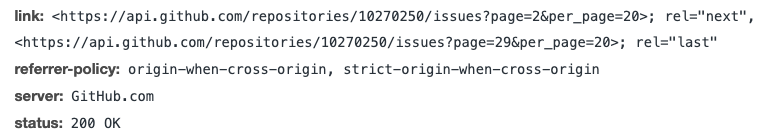
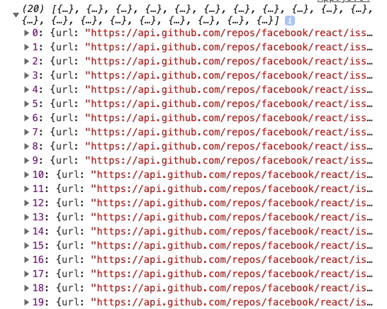
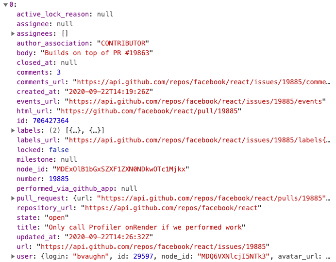
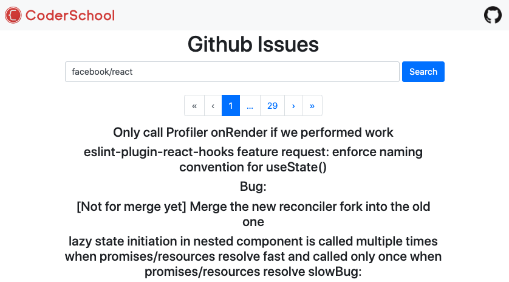
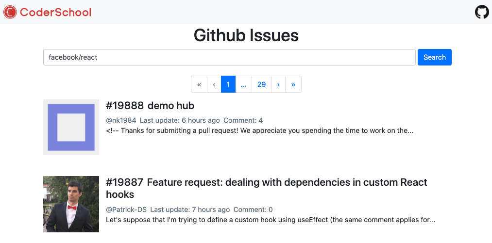

## The issue list with pagination

In this step, we will put the `owner` and `repo` in a request and send it to the Github API to get the list of issues.

**Requirements**: 

* The app will send a request to the Github API for list of issues. 
* The request URL should contain `page=1&per_page=20` to get the first 20 issues.
* During the fetching process, the app should show a loading spinner.
* If the request fail, an error message should be showed.

**Prepared states**

- To prepare for the Pagination component, we need:
  - `pageNum`: a state to controll the current page
  - `totalPageNum`: a state to control the total page number

- To show the list of issues, we need:
  - `errorMsg`: a state to store the error message
  - `issues`: a state that stores the list of issues
  - `showDetail()`: a function that trigger the modal that show the detail infor of an issue.

### The list of issue component

- Create `src/components/IssueList.js`:

```javascript
import React from "react";

const IssueList = ({ itemList, showDetail }) => {
  return (
    <ul className="list-unstyled">
      {itemList.map((item) => (
        <Item item={item} key={item.id} showDetail={showDetail} />
      ))}
    </ul>
  );
};

const Item = ({ item, showDetail }) => {
  const { title } = item;
  return (
    <li>
      <h4>{title}</h4>
    </li>
  );
};

export default IssueList;
```

### The pagination component

- Create `src/components/PaginationBar.js`:

```javascript
import React from "react";
import { Pagination } from "react-bootstrap";

const PaginationBar = ({ pageNum, setPageNum, totalPageNum }) => {
  const handleClick = (page) => {
    setPageNum(parseInt(page));
  };

  const handleClickOnFirst = () => {
    setPageNum(1);
  };

  const handleClickOnLast = () => {
    setPageNum(totalPageNum);
  };
  const handleClickOnNext = () => {
    if (pageNum < totalPageNum) {
      setPageNum((num) => num + 1);
    }
  };
  const handleClickOnPrev = () => {
    if (pageNum > 1) {
      setPageNum((num) => num - 1);
    }
  };

  return (
    <Pagination className="justify-content-center">
      <Pagination.First disabled={pageNum === 1} onClick={handleClickOnFirst} />
      <Pagination.Prev disabled={pageNum === 1} onClick={handleClickOnPrev} />
      <Pagination.Item active={pageNum === 1} onClick={() => handleClick(1)}>
        {1}
      </Pagination.Item>

      {pageNum - 1 > 1 && <Pagination.Ellipsis />}
      {pageNum > 1 && pageNum < totalPageNum && (
        <Pagination.Item active>{pageNum}</Pagination.Item>
      )}
      {totalPageNum > pageNum + 1 && <Pagination.Ellipsis />}

      {totalPageNum > 1 && (
        <Pagination.Item
          active={pageNum === totalPageNum}
          onClick={() => handleClick(totalPageNum)}
        >
          {totalPageNum}
        </Pagination.Item>
      )}

      <Pagination.Next
        disabled={pageNum === totalPageNum}
        onClick={handleClickOnNext}
      />
      <Pagination.Last
        disabled={pageNum === totalPageNum}
        onClick={handleClickOnLast}
      />
    </Pagination>
  );
};

export default PaginationBar;
```

### useEffect()

- For handling the side-effect of fetching issues, we use the `useEffect` hook. Because we need to get issues whenever user search or change the page in Pagination component, the dependencies array of the `useEffect` should be `[owner, repo, pageNum]`

- In `App.js`:

```javascript
// ...
import SearchForm from "components/SearchForm";
import PaginationBar from "components/PaginationBar";
import IssueList from "components/IssueList";
import { ClipLoader } from "react-spinners";

const App = () => {
  const [searchInput, setSearchInput] = useState("");
  const [owner, setOwner] = useState("");
  const [repo, setRepo] = useState("");
  const [loading, setLoading] = useState(false);

  const [issues, setIssues] = useState([]);
  const [pageNum, setPageNum] = useState(1);
  const [totalPageNum, setTotalPageNum] = useState(1);
  const [errorMsg, setErrorMsg] = useState(null);

  // ...

  const showDetail = () => {
    // TODO: Show the modal that contains the issue detail and comments
  };

  useEffect(() => {
    const fetchIssueData = async () => {
      if (!owner || !repo) return;
      setLoading(true);
      try {
        const url = `https://api.github.com/repos/${owner}/${repo}/issues?page=${pageNum}&per_page=20`;
        const response = await fetch(url);
        const data = await response.json();
        if (response.status === 200) {
          const link = response.headers.get("link");
          if (link) {
            const getTotalPage = link.match(
              /page=(\d+)&per_page=\d+>; rel="last"/
            );
            if (getTotalPage) {
              setTotalPageNum(parseInt(getTotalPage[1]));
            }
          }
          setIssues(data);
          setErrorMsg(null);
          console.log(data);
        } else {
          setErrorMsg(`FETCH ISSUES ERROR: ${data.message}`);
        }
      } catch (error) {
        setErrorMsg(`FETCH ISSUES ERROR: ${error.message}`);
      }
      setLoading(false);
    };
    fetchIssueData();
  }, [owner, repo, pageNum]);

  return (
        // ...
        {errorMsg && <Alert variant="danger">{errorMsg}</Alert>}
        <PaginationBar
          pageNum={pageNum}
          setPageNum={setPageNum}
          totalPageNum={totalPageNum}
        />
        {loading ? (
          <ClipLoader color="#f86c6b" size={150} loading={loading} />
        ) : (
          <IssueList itemList={issues} showDetail={showDetail} />
        )}
      </Container>
    </div>
  );
};
export default App;
```

- The total number of pages is in the header of the response. You can find it in the tab `Network` (Chrome DevTools), click on the response, and find `link:...`:



  We use Regex to extract the number in the `useEffect()`

### Result

- You should see the list of issue which is responsed by Github in the Console of the Chrome DevTools



- Click on a element of the list, you should see the content of it:



- On the home page, you should see the list of titles:



- The pagination should work.
- When you type in a random text, an error message should be showed.

### Make it look better

- Let's design the `Item` component that shows the issue detail. In `src/components/IssueList.js`:

```javascript
import { Media } from "react-bootstrap";
import Moment from "react-moment";

// ...

const Item = ({ item, showDetail }) => {
  return (
    <Media
      as="li"
      className="issue mb-5"
      onClick={() => showDetail(item)}
    >
      
      <Media.Body className="text-left">
        <h4>
          <span className="mr-2">#{item.number}</span>
          <span>{item.title}</span>
        </h4>
        <div className="content-body">
          <span className="text-grey mr-2">
            @{item.user.login}
          </span>
          <span className="text-grey mr-2">
            Last update: <Moment fromNow>{item.updated_at}</Moment>
          </span>
          <span className="text-grey">Comment: {item.comments}</span>
          <p>
            {item.body.length <= 99
              ? item.body
              : item.body.slice(0, 99) + "..."}
          </p>
        </div>
        <div className="content-footer">
          {item.labels.map((label) => (
            <span
              className="badge badge-secondary mr-2"
              color={label.color}
              key={label.id}
            >
              {label.name}
            </span>
          ))}
        </div>
      </Media.Body>
    </Media>
  );
};
```

- Add these styles in `App.css`:

```css
.issue:hover {
  background: #c8ced3;
  cursor: pointer;
}

.avatar {
  width: 128px;
  height: 128px;
}

.text-grey {
  color: #657786;
}
```

- And here we go:




Good job! [Back to instructions](../README.md)